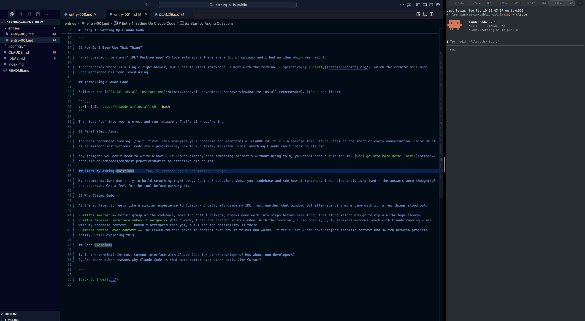

# Entry 1: Setting Up Claude Code

**Date:** 2026-02-06

**TL;DR:** I installed Claude Code, ran my first session, and learned what a CLAUDE.md file is for.

---

## How Do I Even Use This Thing?

First question: terminal? IDE? Desktop app? VS Code extension? There are a lot of options and I had no idea which was "right."

I don't think there is a single right answer, but I had to start somewhere. I went with the terminal - specifically [Ghostty](https://ghostty.org/), which the creator of Claude Code mentioned his [team loved using](https://x.com/bcherny/status/2017742753971769626?s=20).

## Installing Claude Code

There's a cask that handles everything - Claude Code install, AWS Bedrock config, inference profiles, the works:

```bash
brew install --cask fullscript/tools/fullscript-claude-code
```

What does the cask actually do? It sets up Claude Code to run through AWS Bedrock instead of hitting the Anthropic API directly. Bedrock is AWS's managed service for accessing AI models - same Claude models, but routed through our AWS account. This gives the company centralized billing and per-engineer usage tracking via inference profiles tagged to your username. The cask handles `rx sso login` for AWS auth, creates your inference profiles, and generates the env config that points Claude Code at Bedrock.

Start a new terminal, `cd` into your project, and run `claude`. That's it.

For personal projects outside of Fullscript, you can install Claude Code directly with the [official install instructions](https://code.claude.com/docs/en/overview#native-install-recommended):

```bash
curl -fsSL https://claude.ai/install.sh | bash
```

Then `cd` into your project and run `claude`. You'll be prompted to log in with a Claude subscription or Anthropic Console account on first use.

## First Step: /init

The docs recommend running `/init` first. This analyzes your codebase and generates a `CLAUDE.md` file - a special file Claude reads at the start of every conversation. Think of it as persistent instructions: code style preferences, how to run tests, workflow rules, anything Claude can't infer on its own.

If you're working in `hw_admin`, you can skip this - it already has a CLAUDE.md checked into source control.

Here's what it generated for this project:

<details markdown="1">
<summary>Initial CLAUDE.md</summary>

```markdown
# CLAUDE.md

This file provides guidance to Claude Code (claude.ai/code) when working with code in this repository.

## Project Overview

This is a public learning journal - a developer's diary of going AI-first - hosted as a Jekyll site on GitHub Pages using the minima theme. The site lives at https://danialbetres.github.io/learning-ai-in-public.

## Site Structure

- `entries/` - Blog entries as markdown files, numbered sequentially: `entry-000.md`, `entry-001.md`, etc.
- `index.md` - GitHub Pages home page (Jekyll layout: default)
- `README.md` - GitHub repo landing page
- `_config.yml` - Jekyll configuration

## Adding a New Entry

1. Create `entries/entry-NNN.md` with Jekyll frontmatter (`layout: default`, `title`, `date`)
2. Follow the existing entry format: H1 title, **Date** and **TL;DR** lines, `---` separator, then content sections
3. End each entry with the standard footer: `[Back to Index](../)`
4. Add the entry to the table in **both** `index.md` (link without `.md` extension) and `README.md` (link with `.md` extension)

## Writing Style

- Tone is casual, honest, first-person. Not a tutorial - it's a personal journal.
```

</details>

## Start by Asking Questions

My recommendation: don't try to build something right away. Just ask questions about your codebase and see how it responds. I was pleasantly surprised - the answers were thoughtful and accurate. Get a feel for the tool before pushing it.

## So what's different about Claude Code??

At the surface, it feels like a similar experience to Cursor - Ghostty alongside my IDE, just another chat window.



But after spending more time with it, a few things stood out:

- **It's smarter.** Better grasp of the codebase, more thoughtful answers, breaks down work into steps before executing. This alone wasn't enough to explain the hype though.
- **The terminal interface makes it unique.** With Cursor, I had one chatbot in my window. With the terminal, I can open 2, 3, 10 terminal windows, each with Claude running - all with my codebase context. I haven't attempted this yet, but I see the possibility is there.
- **More control over context.** The CLAUDE.md file gives me control over how it thinks and works. It feels like I can have project-specific context and switch between projects easily. Still exploring this.

## Open Questions

1. Is the terminal the most common interface with Claude Code for other developers? How about non-developers?
2. Are there other reasons why Claude Code is that much better over other tools like Cursor?

---

[Back to Index](../)
