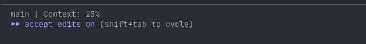

# Entry 2: Context Is Everything

**Date:** 2026-02-13

**TL;DR:** Your agent is only as good as the context it's working with. Here's how to manage it and why it matters.

---

## What Is Context?

Every Claude Code session has a context window - a fixed amount of data the agent can hold and reference while working with you. This includes everything: your prompts, Claude's responses, file contents it reads, command outputs, rules from CLAUDE.md - all of it counts.

The window is large (200k tokens), but it fills up faster than you'd expect. A single large file read or a long command output can eat a meaningful chunk. When the context gets full, Claude doesn't just stop - it uses automatic summarization to compress older parts of the conversation. The problem is that summarization is lossy. Earlier details get fuzzy, and you'll start noticing the agent forgetting things you told it, or giving less precise answers.

The takeaway: context management isn't optional. If your agent starts drifting, it's probably not broken - it's just lost track of what matters.

## Keep Conversations Focused

The simplest thing you can do is keep each session focused on a single topic. If you just finished debugging a test and now want to refactor a component - start fresh. You can clear your context with the `/clear` command in Claude Code.

But sometimes you don't want to lose everything. Maybe you're deep into a task and the context is getting bloated, but you're not done yet. That's where `/compact` comes in - it summarizes the current conversation to free up space while keeping the gist. You can even guide what it retains:

```
/compact focus on the authentication changes we discussed
```

This is a middle ground between staying in a ballooning session and nuking everything with `/clear`.

## Persisting Context Across Sessions

Before you clear or compact, think about whether there's anything worth saving for next time. You can ask Claude to update the `CLAUDE.md` file with decisions, patterns, or rules you've established during the session. That way, every future session picks up where you left off.

But what about context that's specific to a particular feature or project area? You probably don't want to clutter CLAUDE.md with notes about one specific module. Instead, ask Claude to write it to a separate markdown file - something like `docs/auth-notes.md` - that you can reference later when you pick that work back up.

## CLAUDE.md vs CLAUDE.local.md

In our codebase, `CLAUDE.md` is checked into source control. It contains shared context for the whole team - project structure, conventions, how to run tests. You shouldn't add personal notes or work-in-progress context there.

That's what `CLAUDE.local.md` is for. It lives in the same directory but is gitignored by default - it's personal to you. Use it for your own notes, preferences, or project-specific context that doesn't belong in the shared file. Claude reads both at the start of every session.

## Monitoring Your Context

So how do you know how full your context window is? You can always just ask Claude - "how much context have I used?" works fine.

But there's a better way. Claude Code has a status line feature that sits below your prompt and displays live information. You configure it using the `/statusline` skill (I'll cover skills in a later entry). For example, here's what I ran:

```
/statusline generate a status line that displays the branch i'm on along with what percent my context window is at
```

You can customize it to show whatever you want - a percentage, a visual bar, your current branch, anything useful. Here's what mine looks like:



Having the context percentage always visible makes it easy to know when it's time to `/compact` or `/clear`.

---

[Back to Index](../)
