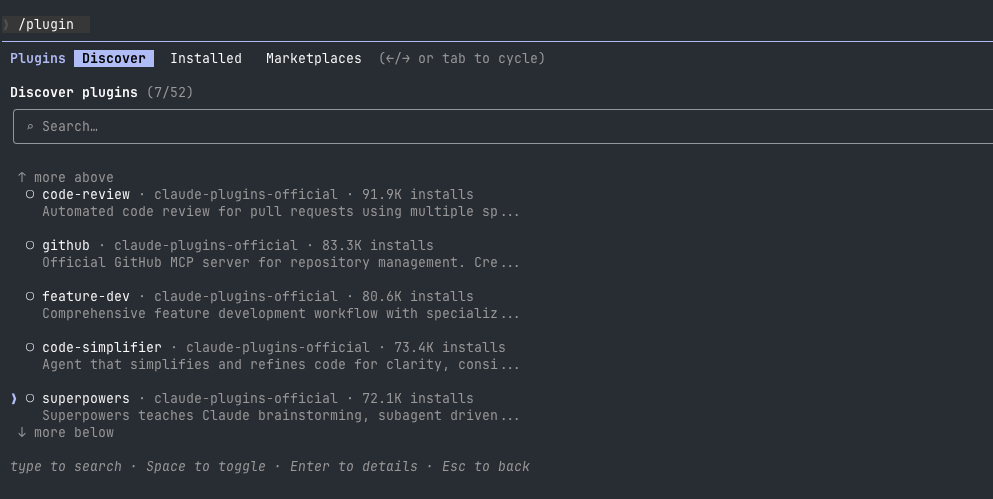
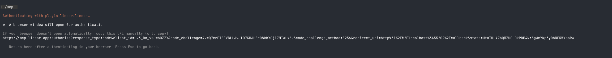
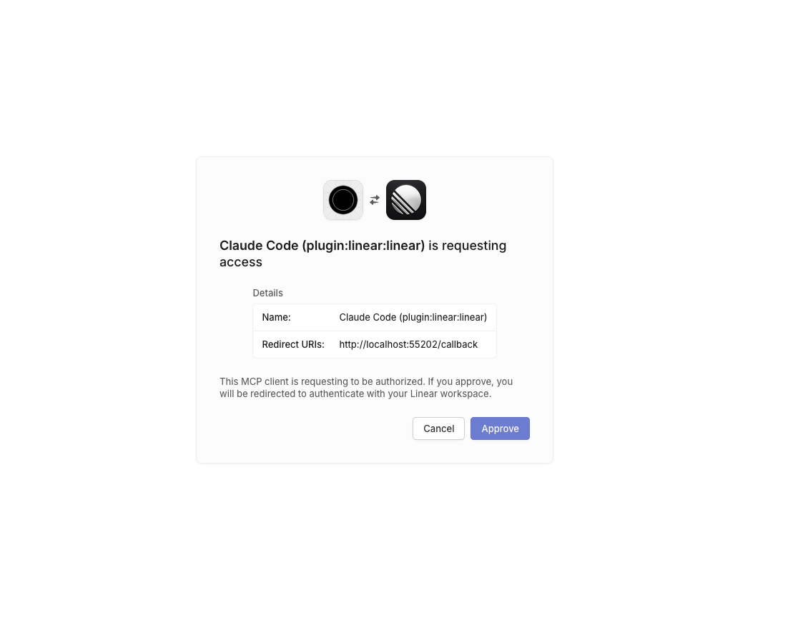

# Entry 3: MCPs - Giving Your Agent Hands

**Date:** 2026-02-13

**TL;DR:** MCP (Model Context Protocol) lets you connect Claude Code to external tools like Linear, GitLab, and Slack. It turns your agent from a code assistant into something that can interact with your whole workflow.

---

## The Problem

Out of the box, Claude Code can read your files, run bash commands, and search your codebase. That's useful, but your work doesn't live entirely in your terminal. Tickets are in Linear. Code reviews are in GitLab. Conversations are in Slack. Without a way to reach those systems, Claude is stuck in a silo.

## What MCP Is

MCP stands for Model Context Protocol. It's a standard for connecting AI agents to external tools and data sources. You configure an MCP "server" - a small program that exposes specific capabilities - and Claude can call those capabilities as tools.

The server handles all the API logic, authentication, and request formatting. Claude just sees a list of available tools with descriptions and parameters. No guessing endpoints, no hand-crafted curl commands.

Anthropic created the protocol, but it's open - Cursor, Windsurf, VS Code Copilot, and other AI tools support it too. An MCP server built for one works with others.

## A Live Example

I have the Linear MCP server installed. Here's what happens when I type "list my tickets":

Claude calls the Linear MCP's `list_issues` tool with `assignee: "me"` and returns a formatted table of my open and completed tickets - identifiers, titles, statuses, priorities, teams. No API key in my prompt, no curl, no guessing at Linear's API schema.

That's the point. I asked a plain English question and got structured data back from a third-party service.

## Finding and Installing MCP Servers

Inside Claude Code, run `/plugin` to browse and install from a curated marketplace.



Once you install one, you need to restart your session for it to load. After restarting, run `/mcp` - you should see your newly installed MCP listed, but it'll need authentication. Click on it and it'll kick off the auth flow:



A browser window opens where you authorize Claude Code to access the service:



Once you approve, you're good to go.

Our [engineering docs](https://engineering-docs.fullscript.cloud/Guides/mcps/) also have instructions for installing MCPs within Claude Code and other agentic tools if you prefer that approach.

If nothing exists for an internal tool, you can build one. The TypeScript and Python SDKs make it straightforward - define your tools, write handlers that call your API, done.

## How to Actually Use Them

The main way is just natural prompting. Say what you want and Claude picks the right tool. You don't need to name the MCP or know the tool's function signature.

You can also put instructions in your `CLAUDE.local.md` to have Claude use MCPs automatically:

```
When starting work on a ticket, always pull the full details from Linear first.
When opening a PR, check GitLab for related MRs on the same branch.
```

You can also chain tools together in a single prompt: "Pick up CORE-1294, read the full ticket, create a branch, and update the status to In Progress." That's Linear + git + Linear again, all from one ask.

MCPs can also be used within skills - we'll look at those in a future entry.

## Things to Keep in Mind

- **Security matters.** Installing an MCP server gives Claude access to whatever that server exposes. A database server with write access means Claude can modify data. A Slack server means Claude can send messages as you. Be intentional.
- **They run per-session.** MCP servers spin up when you start Claude Code and shut down when you exit. Nothing running in the background.

---

[Back to Index](../)
