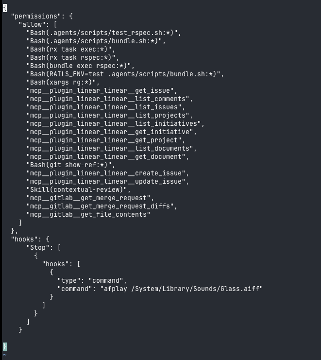

# Entry 5: Small Wins and Tricks

**Date:** 2026-02-23

**TL;DR:** A few things I've picked up - saving context to a doc for later, using Claude to create Linear tickets from a design doc, and setting up a notification sound for when it's done working.

---

## Saving Context for Later

If my context window is getting full or I'm done with a topic but know I'll come back to it, I ask Claude to write everything to a document - all the context, decisions, and where we left off - so that a fresh session can read it and pick up where we left off.

Something like: "Write a doc with all the context from this session so another agent can continue this work later."

Next time I'm ready to continue, I just point Claude at that doc and it has what it needs. Way better than trying to re-explain everything from scratch.

## Creating Linear Tickets with Claude

I had Claude create all the Linear tickets for a project and it did a great job. I gave it a design doc (that it had also helped write in a previous session) and asked it to create tickets under a specific Linear project.

The result was solid. The split of work made sense, but the real value was the detail it put into each ticket and the configuration - it set all the blocking and blocked-by relationships between tickets automatically. We only had to make minor adjustments to the split, but it cut down on ticket creation significantly and produced more detailed tickets than I would have written manually.

You can see the specific project I did this for here: [Phase 0B: Infrastructure and Converter](https://linear.app/fullscript/project/phase-0b-infrastructure-and-converter-db4c62524167/issues?layout=board&ordering=priority&grouping=workflowState&subGrouping=none&showCompletedIssues=all&showSubIssues=true&showTriageIssues=true).

## Notification When It's Done

If you have multiple Claude terminal sessions running or you've kicked off a time-consuming task, it helps to get a ping when it's done. You can set up a hook in your `.claude/settings.local.json` that plays a system sound when Claude stops executing:

```json
"hooks": {
  "Stop": [
    {
      "hooks": [
        {
          "type": "command",
          "command": "afplay /System/Library/Sounds/Glass.aiff"
        }
      ]
    }
  ]
}
```

Here's what mine looks like in the full file:



You can swap `Glass.aiff` for any other sound under `/System/Library/Sounds`.

---

[Back to Index](../)
